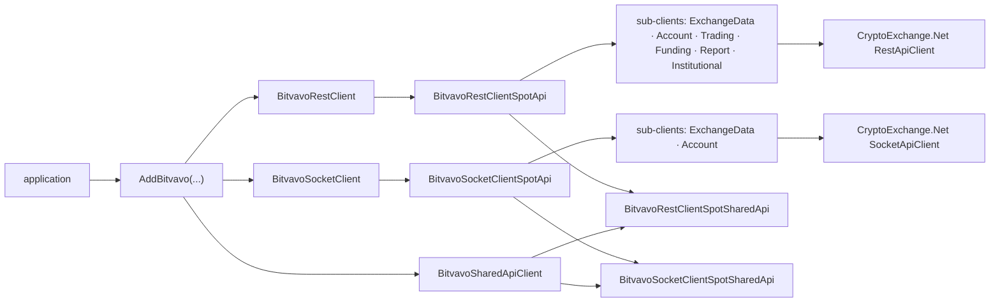

# Architecture — Bitvavo.Net 0.5.0

How the library is built and why. For usage see [README.md](README.md); for history see [CHANGELOG.md](CHANGELOG.md).
Built on CryptoExchange.Net (CE) 13.1.0; structure follows Kraken.Net 8.6.0 so both libraries load in one process.

## 1. Layers

- `BitvavoRestClient` / `BitvavoSocketClient` own one spot API client each. The API clients (`internal sealed`) derive from CE's `RestApiClient` / `SocketApiClient` and are reached only through the public interfaces under `Interfaces/Clients`.
- Sub-clients are plain classes holding one static `RequestDefinitionCache` each; a method builds its `Parameters`, asks the cache for a definition (verb, path, authenticated, weight, gate) and calls `SendAsync`.
- Results: `HttpResult<T>` (REST), `WebSocketResult<UpdateSubscription>` (sockets). Protocol errors are results, never exceptions.

## 2. REST request path

`sub-client → RequestDefinitionCache.GetOrCreate(method, baseAddress, path, gate, weight, authenticated, parameterPosition) → RestApiClient → BitvavoAuthenticationProvider.ProcessRequest → HTTP → BitvavoRestSpotMessageHandler → HttpResult<T>`

- A definition is cached on first use by `path + method + baseAddress` and keeps its gate and weight for good. Endpoints whose weight varies per call (open orders, cancel orders, 24 h ticker, the institutional open/cancel calls) pass `weight:` to `SendAsync`; every other weight is the one of the documentation.
- `BitvavoExchange.ParameterSerializationSettings` is the one serialization policy: decimals travel as JSON strings, enums as their mapped wire values, `DateTime` as unix milliseconds, parameters sorted ordinally and case-insensitively. The same bytes are what the signature covers.
- DELETE `/order` and `/orders` send their parameters in the query (`parameterPosition: InUri`); atomic cancel and the institutional DELETEs send a JSON body.
- Responses are parsed with `AllowReadingFromString` (Bitvavo sends numbers as strings).

### Signing and time

- Signature = HMAC-SHA256 hex of `timestamp + METHOD + "/" + path [+ "?" + query] + body` with the API secret; headers `Bitvavo-Access-Key/-Signature/-Timestamp/-Window`.
- The body is signed whenever the request's parameters travel in the body (`ParameterPosition == InBody`) — decided by position, not by verb, so DELETEs with a body are covered. Public endpoints (including the report endpoints) are not signed.
- The timestamp comes from CE's `GetMillisecondTimestamp`, which applies the measured clock offset when `AutoTimestamp` is on. The offset is measured through `GET /v2/time` — a public definition, because a signed time request would need the time sync it is performing.
- `ReceiveWindowMs` (default 10 000, Bitvavo maximum 60 000) is the `Bitvavo-Access-Window`; the same value is the `window` of the WebSocket `authenticate` action.

## 3. Rate limiting

Bitvavo allocates 1000 weight points per minute and tracks them **per account** for authenticated requests (all keys, all sub-accounts) and **per IP** for unauthenticated ones — two independent budgets. Overrunning blocks the caller for 1 minute (authenticated) or 15 minutes (IP), answered with HTTP 429 and error code 105.

| Piece | Role |
|---|---|
| `BitvavoRateLimiters` | two `RateLimitGuard`s, both `Sliding`, limit 1000 per minute: unauthenticated (`AuthenticatedEndpointFilter(false)`, per host) and authenticated (`AuthenticatedEndpointFilter(true)`, one constant key = **one tracker per process**, whichever API key signs) |
| `MaxUtilization` (default 0.9) | headroom: 10 % of each budget stays free for other processes on the same account or IP. Bounds: `heaviest weight (100) / limit` … 1, checked at construction |
| admission | the ratio applied to a request is the stricter of `MaxUtilization` and the caller's CE `RateLimitAdmission`; a request whose weight can never fit is refused with `ClientRateLimitError` (CE's tracker would throw) |
| `BitvavoRateLimitGate` | the one gate every definition is created with; stateless, forwards each call to the **current** `BitvavoExchange.RateLimiter` |
| `BitvavoExchange.RateLimiter` | static, settable (null → `ArgumentNullException`), as `KrakenExchange.RateLimiter`; replacing it starts counting from zero |

Why sliding: Bitvavo resets its counter on the clock minute, but the host clock measured 480–529 ms ahead of Bitvavo's. A clock-aligned window would admit a full budget twice around the boundary; a sliding window counts the trailing 60 s and is immune to the skew.

Why a static limiter: the budget belongs to the account or IP address, not to a client instance, so one process-wide object is the faithful model. Definitions are cached statically and keep the gate they were created with, which is why the gate indirection exists — it keeps the setter effective for endpoints already called. The alternative (a limiter injected per client through the options) would need the definition cache to be per client.

- WebSocket frames (weight 1 each in Bitvavo's accounting) are **not** counted client-side. The cancel-on-disconnect heartbeat (`ResetCancelOnDisconnectAsync`, documented weight 5) is deliberately ungated: a refused heartbeat lets the timer expire and Bitvavo cancels the group's orders; at one call per ~30 s its weight fits in the free headroom.
- On HTTP 429 the server's `errorCode` (105, or 112 for WebSocket message rate) and message are kept on `ServerRateLimitError`; Bitvavo sends no `Retry-After`.

## 4. Errors

`BitvavoErrors.SpotMapping` maps the 90 documented error codes onto CE's `ErrorType` and `IsTransient`; the server's message travels next to the mapped type. Code 109 (503, request timed out) maps to `Timeout` and is **not** transient: the operation may or may not have happened, so read the order back before retrying. Code 429 is an HTTP 400 about decimal places and has nothing to do with HTTP 429. An unknown code maps to `ErrorType.Unknown`.

## 5. WebSocket

- One connection serves many channels (`SocketSubscriptionsCombineTarget = 10` subscriptions are combined per connection by default). Messages are typed by their `event` field; a topic mapping routes each event to its subscription (`market` for trades, orders and fills, `market + interval` for candles).
- **Subscribe is fire-and-forget.** Bitvavo sends no per-request acknowledgment — only an aggregated `subscribed` event at arbitrary points — so, like the official Go and Python SDKs, the library counts a sent subscribe as success: `BitvavoSubscribeQuery` completes at send time and presets its result. Cancelling the token passed to a subscribe call closes the subscription.
- The private `account` channel emits `order` and `fill` events only (no balance events, so there is no balance subscription). A private subscription authenticates its connection first: the `authenticate` action carries the key, `HMAC-SHA256(timestamp + "GET/v2/websocket")`, the timestamp and the window; the connection is usable when `{"event":"authenticate","authenticated":true}` returns.
- **`SetApiCredentials`:** CE reuses any authenticated connection for the next private subscription without asking which key authenticated it. The socket API client therefore records the key of each connection when it builds the `authenticate` frame (a weak table) and refuses a connection that holds another key. After a key change the old connection stays open for the subscriptions it already carries; the next private subscription gets a connection of its own, authenticated with the new key. A reconnect authenticates again with the key held then (right when the key of one account is rotated; another account needs a client of its own). Public subscriptions are unaffected.
- **A key change is atomic.** CE replaces the signing provider in several steps (drop it, mark it unbuilt, store the credentials); a reader in between can leave the client on the old key until the next change or find no provider (measured against the base class: 15 of 100,000 changes under a concurrent reader). Both spot API clients override `AuthenticationProvider`, `SetApiCredentials` and `SetOptions` to take one lock, so every reader sees the old state or the new one.

## 6. Options, DI, lifecycle

- `BitvavoRestOptions`, `BitvavoSocketOptions`, `BitvavoOptions : LibraryOptions<…>` (+ `SharedApi`). `BitvavoOptions.Create` / `CreateFromConfiguration` normalise: the top-level environment and credentials flow to the REST and socket sections that did not set their own; an environment name is resolved case-insensitively and an unknown name throws. Precedence per section, strongest first: the section's own value, the top level, the process-wide default (`SetDefaultOptions`, the lowest layer, as on the legacy overload), the live environment.
- `AddBitvavo` has three overloads: the 0.4.0 shape `(Action<BitvavoRestOptions>?, Action<BitvavoSocketOptions>?)` (kept, `[OverloadResolutionPriority(1)]`, with a polyfill of the attribute on net8.0), `(IConfiguration)` and `(Action<BitvavoOptions>)`. At language version C# 13 or later a lambda written as the single positional argument keeps binding to the old overload — it is the 0.4.0 call shape — and the library-options overload is selected by a lambda that cannot apply to the REST options (one touching `Rest`, `Socket` or `SharedApi`). The attribute is ignored below C# 13 (a net8.0 project defaults to C# 12, whichever compiler builds it): there a lambda over `ApiCredentials` or `Environment` binds the library-options overload and `AddBitvavo(null)` is ambiguous — set `<LangVersion>13.0</LangVersion>` or type the lambda parameter. Measured with SDK 10.0.401 on a net8.0 consumer.
- Every overload feeds the **options pipeline** (`AddOptions<T>().Configure(…)`), never a pre-built `Options.Create` singleton, so an application's `PostConfigure<BitvavoRestOptions>` runs after it and wins (the execution package makes the rate limiter fail fast that way).
- The REST client is registered per resolution on a **typed `HttpClient`** (`Timeout = RequestTimeout`, handler from `LibraryHelpers.CreateHttpClientMessageHandler`, handler lifetime infinite — as in the JKorf libraries: the handler is never rotated, is not disposed with the container because the factory is not disposable, and recycles its pooled connections every 15 minutes through `HttpPooledConnectionLifetime`). The socket client is a singleton unless `SocketClientLifeTime` says otherwise; the spot API interfaces follow the lifetime of their client.
- The clients register **once, `TryAdd` as in 0.4.0**: a client the application registered first stays the one that resolves, and a second `AddBitvavo` adds its options (the later call's settings win) but no second set of clients — the first call decides their lifetimes. Each REST and socket client gets a **copy** of the options (`Copy()`): CE's `SetOptions` writes the timeout and the proxy into the options object the client holds, which would otherwise be the one the container hands to every later client.
- `IBitvavoSharedApiClient` / `BitvavoSharedApiClient` holds the REST and socket Shared API and the transport preference (`SharedApi.PreferredTransport`, default REST). `RegisterSharedRestInterfaces`, `RegisterSharedSocketInterfaces` and `RegisterSharedApiClient` hand out every capability interface from the container. The capability interfaces resolve through the Shared API client, which needs both transports: with `SocketClientLifeTime = Scoped` resolve them from a scope (the root refuses a scoped service when scope validation is on); with `Transient`, every root resolution builds a socket and a REST client that the container keeps until it is disposed.

## 7. Shared API

One class per transport (`BitvavoRestClientSpotSharedApi`, `BitvavoSocketClientSpotSharedApi`, both `SharedApiBase`) holds the legacy **V1** interfaces and the **V2** capabilities on **one instance**: `SharedClient` and `SharedApi` of the API client return the same object, which is not the API client itself.

**Open for extension, closed for modification.** A capability is one partial file `…SharedApi.<Capability>.cs` that declares the interface(s) it implements and holds its options and its call. Adding one touches three places and nothing else: the file, its interface in the V1/V2 aggregate (`IBitvavo…SpotApiShared.cs`), and its options object in `SetCapabilities`. `BitvavoSharedApiRegistrationTests` fails when the three disagree, so a capability can never be implemented but silently unregistered. Capability-specific mappings live in their own partial of `BitvavoSharedMappingExtensions`.

Every call validates its request against its options first (nothing is sent on a rejected request), calls the typed sub-client, and maps the answer.

REST V2 capabilities: assets (`IGetAssetRest`, `IGetAllAssetsRest`), klines, spot symbols, ticker, all tickers, order book, book ticker, recent trades, balances, fees, ledger, deposit addresses, deposit history, withdrawal history, withdraw, place / get / get-by-client-id / open / closed spot orders, order trades, user trade history, cancel / cancel-by-client-id, cancel-all (global and per symbol), edit / edit-by-client-id, spot trigger orders (place, get, cancel). Socket: klines, trades, spot orders, user trades. Authoritative list: `IBitvavoRestClientSpotSharedApi` and `IBitvavoSocketClientSpotSharedApi`, and `Discover()` at runtime.

Exchange parameters (the Shared requests have no field for them): `OperatorId` on every order operation (Bitvavo requires it), `Markets` on the private socket subscriptions (the account channel is subscribed per market), optional `TriggerReference` (`lastTrade` by default) on trigger orders.

Notes: Bitvavo has no trigger-order endpoint — a trigger order is an ordinary order of type `stopLoss`, `stopLossLimit`, `takeProfit` or `takeProfitLimit` that waits in status `awaitingTrigger`. `clientOrderId` must be a UUID (`GenerateClientOrderId`). The trades of an order are the fills embedded in the order response. `pricePrecision` is null on every market the live API lists, so the symbol's price grid comes from `tickSize`. Bitvavo fee rates are fractions; the Shared fee is a percentage (×100). The two cancel-all capabilities return no ids (CE's contract has no data), and a Withdraw uses `POST /crypto/withdrawal`, which requires the network and charges the fee on top of the amount.

## 8. Tests

- The only test seam is the transport: `StubHttpMessageHandler` (canned JSON, records requests), `HangingHttpMessageHandler`, CE's `TestSocket` and `RecordingSocketFactory`. The library itself is never replaced by test doubles; rate limiting is never switched off — `[FreshRateLimiter]` gives every test an empty budget and the assembly runs serially so the static limiter is safe to replace.
- `BitvavoEndpointContracts` is the endpoint contract table (verb, path, query, body, signature, weight) used by the wire golden tests and the limiter tests; `Every_rest_endpoint_has_a_contract_row` fails for a new endpoint without a row.
- Shared API tests per capability, plus the registration guard and DI tests that call each `AddBitvavo` overload directly.
- `BitvavoLivePublicTests` call the live public API (REST, the Shared API, one WebSocket subscription; no credentials, about 60 weight points) and are skipped unless `BITVAVO_LIVE_PUBLIC=1`. They exist because documentation and recorded payloads can disagree with the live API: a query naming one market answers a single object although the specification shows an array (`SingleOrArrayConverterFactory` reads either shape).
- Coverage gate: every class ≥ 90 % line and branch (measured with `dotnet-coverage` and `reportgenerator` on the test executable).

## 9. Not implemented

Public WebSocket `ticker`, `ticker24h` and `book` channels · `SymbolOrderBook` · trackers · a multi-user client provider · WebSocket request/response actions (`privateCreateOrder` …) · WebSocket `error` event routing · a balance subscription (Bitvavo has no balance event) · batch orders (no Bitvavo endpoint) · futures and margin (Bitvavo is spot-only).

## 10. Not measured

These need live credentials or a live clock and are not verified by the test suite:

- whether the authenticated budget is per API key or per account (the limiter assumes per account: one tracker);
- the shape of Bitvavo's reply to a rejected WebSocket `authenticate`;
- that the atomic-cancel and institutional DELETEs verify a signature over their JSON body (the library signs it, as the documentation specifies for a request with a body; 0.4.0 left it out);
- whether the order of the deposit, withdrawal, account-history and order-history lists is newest first (assumed, like the documented trade history);
- the direction in which a stop loss and a take profit fire (the usual meaning is assumed; Bitvavo's text only says "prevent further losses" and "ensure profits");
- whether a `429` should back off until `bitvavo-ratelimit-resetat` (not implemented);
- whether a time offset is ever fed for the WebSocket (Bitvavo's frames carry no server time).
